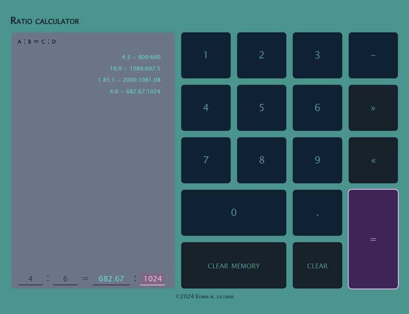
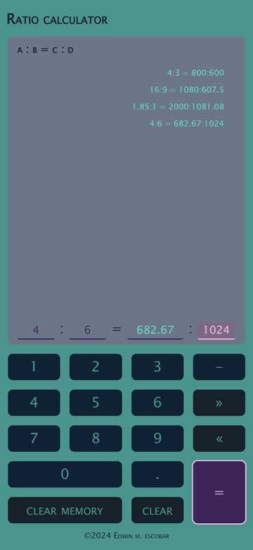

# ratio-calculator

## Description
[Repo](https://github.com/escowin/ratio-calculator) |
[Live URL](https://escowin.github.io/ratio-calculator)
    
The Ratio Calculator is a lightweight Progressive Web App (PWA) designed to compute the remaining value from three provided input values. It was developed as a personal challenge in utilizing array iteration, object-oriented programming (OOP) principles, and implementing test-driven development (TDD) practices. The primary goal was to create a streamlined codebase with a clear separation of concerns.

### Motivation
This app came about as a reaction to previous PWA development. When running builds for [sun-tracker](https://github.com/escowin/sun-tracker), I noticed `nodule_modules/` would take up a considerable size relative to the rest of the codebase, due to its third-party depenendcies. By avoiding external dependencies in this app, the file size of `app.bundle.js` has been kept to a minimum. Additionally, this approach maximized the readability of the source codebase, emphasizing proficiency in fundamental JavaScript, OOP, TDD, and client-side memory management.

### Development highlights:
- Utilization of array variable objects created via for loop iteration.
- Ensuring data consistency between the DOM and calculator logic through array destructuring, object instantiation, and strict equality.
- Construction of application logic guided by TDD principles.
- Maintenance of value synchronicity among class constructors, the IndexedDB database, and DOM variables through iterative calls.
- Leveraging the data-* attribute to facilitate setting values for form input elements via a UI keypad.

### Future development:
- Implementation of keyboard event listeners to enhance user input accessibility.

## Table of Contents
- [Installation](#installation)
- [Test](#test)
- [Usage](#usage)
- [Features](#features)
- [Credits](#credits)
- [Author](#author)

## Installation
### Local machine
Run the following command to install necessary dependencies:
```
$ npm i
```

### Browser via [live URL](https://escowin.github.io/ratio-calculator)
- Desktop : click install icon in address bar.
- iOS: click 'Add to Home Screen'.

## Test
Run the following command to run tests:
```
$ npm run test
```

## Usage
Run the following command to run app locally:
```
$ npm run start:dev
```





Using the keypad

## Features
- **Client-Side Database Memory Persistence:** Store data locally for seamless user experience across sessions.
- **Offline Functionality:** Enjoy uninterrupted usage even without an internet connection.
- **PWA Optimization:** Fast loading times and responsiveness thanks to Progressive Web App technology.
- **Accessible UI Touch Keypad:** Utilize an intuitive touch keypad with ARIA-label accessibility, enhancing usability for all users.
- **Appealing Responsive Design:** UI offers clear visual cues for focused elements, improving overall user experience under a variety of displays.


## Credits
- Languages: HTML, CSS, Javascript
- Frameworks: [Node](https://nodejs.org/en), [Jest](https://jestjs.io/)
- Libraries: [webpack](https://github.com/webpack/webpack), et al.
- Graphics: [Adobe Illustrator](https://www.adobe.com/products/illustrator.html)
- Database: [indexedDB](https://developer.mozilla.org/en-US/docs/Glossary/IndexedDB)

## Author
### Edwin Escobar
- [Email](mailto:edwin@escowinart.com)
- [GitHub](https://github.com/escowin)
