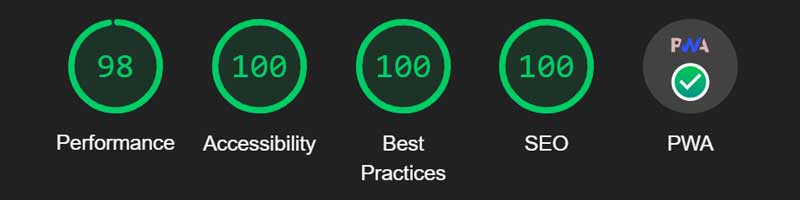

# ratio-calculator

## Description
[Repo](https://github.com/escowin/ratio-calculator) |
[Live URL](https://escowin.github.io/ratio-calculator)
    
A lightweight PWA ratio calculator that calculates the remaining value from three given input-values. The development of this app was an exercise in array iteration, object oriented programming, and test driven development in order to streamline a codebase built around separation of concerns.

This app came about as a reaction to previous PWA development. When running builds for [sun-tracker](https://github.com/escowin/sun-tracker), I took notice of the size `node_modules` would occupy in each bundle. By not using dependencies in this application, I have been able to further my understanding of native JavaScript, OOP, and TDD while also keeping the file size of `app.bundle.js` as small as possible.  

### Development highlights:
- array variable objects defined through `for` loop iteration
- maintained data consitency between dom & calculator through iteration, array destructuring, object instantiation, and strict equality.
- building up application logic through TDD

### Future development:
- Class inheritance between `Display` & `Calculator`
- Parameter elmination within `Display` class methods
- Streamline statement evaluations within `Calculator` method
- Expand jest-environment jsdom TDD

## Table of Contents
- [Installation](#installation)
- [Test](#test)
- [Usage](#usage)
- [Features](#features)
- [Credits](#credits)
- [Author](#author)

## Installation
### Local machine
Run the following command to install necessary dependencies:
```
$ npm i
```

### Browser via [live URL](https://escowin.github.io/ratio/calculator)
- Desktop : click install icon in address bar.
- iOS: click 'Add to Home Screen'.

## Test
Run the following command to run tests:
```
$ npm run test
```

## Usage
Run the following command to run app locally:
```
$ npm run start:dev
```


## Features
- Offline functionality
- PWA Optimization


## Credits
- Languages: HTML, CSS, Javascript
- Frameworks: [Node](https://nodejs.org/en), [Jest](https://jestjs.io/)
- Libraries: [webpack](https://github.com/webpack/webpack), et al.
- Graphics: [Adobe Illustrator](https://www.adobe.com/products/illustrator.html)

## Author
### Edwin Escobar
- [Email](mailto:edwin@escowinart.com)
- [GitHub](https://github.com/escowin)
